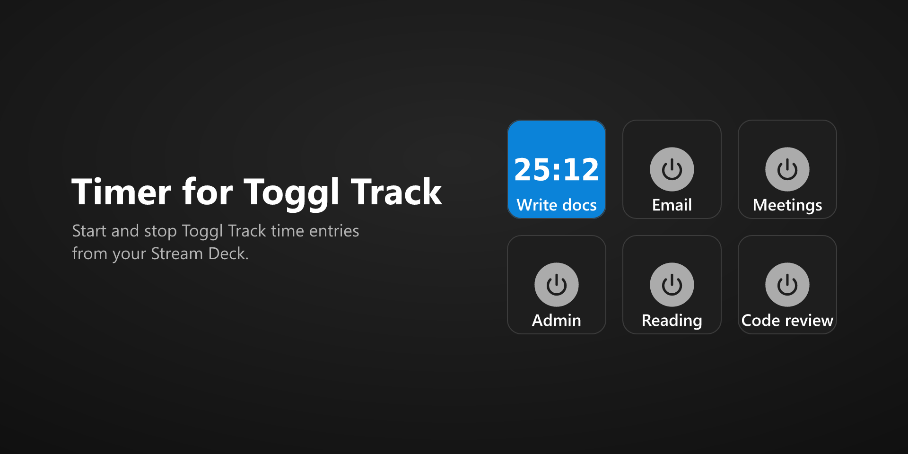

# Timer for Toggl Track

Start and stop [Toggl Track](https://toggl.com/track/) time entries from an Elgato Stream Deck. This is a rebuild of the deprecated [tobimori/streamdeck-toggl](https://github.com/tobimori/streamdeck-toggl) plugin on the current Stream Deck SDK, designed to stay within the API limits of Toggl's Free plan.



## Install

Download `com.raaedkabir.toggl-track.streamDeckPlugin` from the [latest release](https://github.com/raaedkabir/streamdeck-toggl-track/releases/latest), then open it to install it in Stream Deck. The plugin requires Stream Deck 7.1 or later, on Windows 10 or macOS 12 or later.

## Setup

1. Drag the **Timer** action (under **Timer for Toggl Track**) onto a key.
2. Paste your API token from your [Toggl profile](https://track.toggl.com/profile). Every key shares it, and it isn't included when you export a Stream Deck profile.
3. Choose a workspace. Optionally, add a description, a project, and tags.

## Using the keys

- Press a key to start its time entry, and press it again to stop it. Starting a key stops whatever else was running.
- While its entry runs, a key shows the project's color (pink when there's no project) with the elapsed time in large digits across the middle.
- A key shows its Stream Deck title, or the description when it has no title. The title's font, size, and position stay the same while the entry runs. Put the title at the top or bottom to leave room for the elapsed time.
- A key lights up when the running entry has the same workspace, project, description, and tags. Identical keys stay in sync, even across profiles.
- In a multi-action, choose the **Running** or **Stopped** state to start or stop the entry instead of toggling it.
- The key shows an alert when the API token or workspace is missing, or when Toggl can't be reached.

## Toggl API limits

Toggl's Free plan allows 30 requests an hour for your own data, which includes checking the running timer, and 30 an hour per organization for everything else. To stay within those limits, the plugin:

- checks the running timer every 5 minutes, and only while keys are visible. Timers started or stopped in other Toggl apps can take up to 5 minutes to show on the keys.
- counts elapsed time locally.
- checks again before a key press when the last check is more than a minute old.
- caches workspaces, projects, and tags for 15 minutes. Use the refresh buttons in the key's settings to reload them sooner.
- pauses background checks when 5 or fewer requests remain in the hour, and waits for the limit to reset once it's reached.

## Privacy

The plugin doesn't collect any data. Stream Deck stores your API token on your computer, and the plugin sends it only to Toggl's API (`api.track.toggl.com`), with the requests that start and stop time entries and list your workspaces, projects, and tags. The plugin's log files never contain the token.

## Support

Report problems, or suggest ideas, in [GitHub issues](https://github.com/raaedkabir/streamdeck-toggl-track/issues).

## Development

Requires Node.js 24 and Stream Deck 7.1 or later.

```sh
nvm install          # Node.js version from .nvmrc
npm install
npx streamdeck dev   # enable Stream Deck developer mode (once)
npm run build        # bundle into com.raaedkabir.toggl-track.sdPlugin/bin
npm run link         # link the plugin into Stream Deck (once)
npm run watch        # rebuild, and restart the plugin, on change
npm run validate     # check the manifest and images
npm run pack         # build, validate, and package into dist/
```

Stream Deck reads `manifest.json` only when it starts, so restart Stream Deck after changing it.

### Releasing

1. Update `Version` in [manifest.json](com.raaedkabir.toggl-track.sdPlugin/manifest.json); it has four parts, such as `1.0.1.0`.
2. Commit, then push a matching tag, such as `v1.0.1`. The [Build workflow](.github/workflows/build.yml) packages the plugin and publishes it as a GitHub release.
3. Submit the package to the Elgato Marketplace in Maker Console, using the listing in [marketplace/](marketplace/README.md).

## License

[MIT](LICENSE). The icons use Lucide's "power" and "timer" icons, the elapsed time uses digits from DejaVu Sans Condensed Bold, and the key settings use sdpi-components; see [THIRD_PARTY_NOTICES.md](com.raaedkabir.toggl-track.sdPlugin/THIRD_PARTY_NOTICES.md) for their licenses, and those of the bundled npm packages.

Toggl and Toggl Track are trademarks of Toggl. This plugin isn't affiliated with or endorsed by Toggl.
